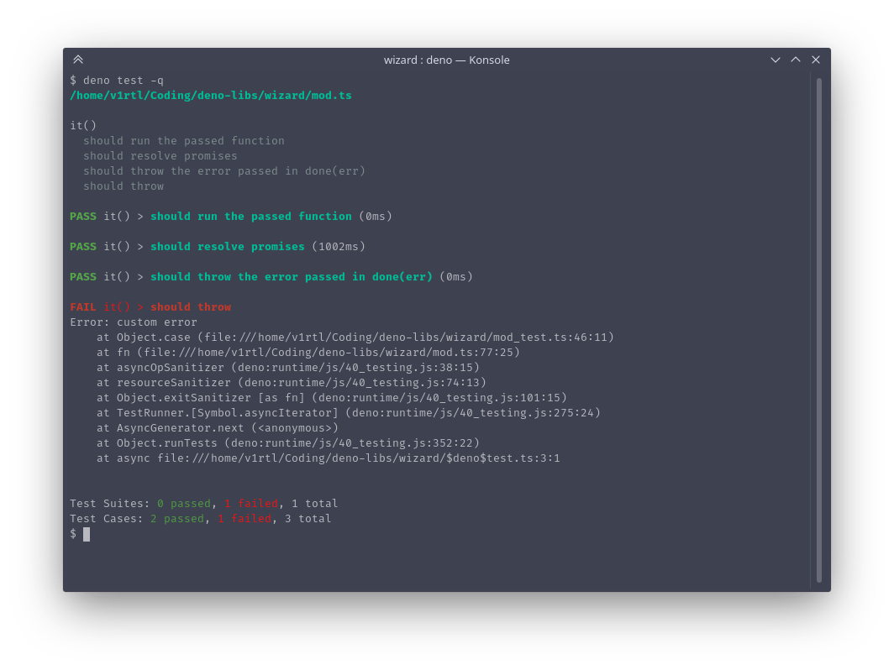

# 🧙 Wizard

 [![GitHub Workflow Status][gh-actions-img]][github-actions]
[![Codecov][codecov-badge]][codecov] [![][docs-badge]][docs]

Minimal Jest-like unit testing framework for Deno.

## Features

- `describe`, `it`, `expect` functions like in Jest
- colorful output with summary
- uses `Deno.test`

## Usage

```ts
// mod_test.ts
import { describe, it, expect, run } from 'https://deno.land/x/wizard/mod.ts'

describe('A test suite', () => {
  it('should sum a + b', () => {
    expect(1 + 2).toBe(3)
  })
})

run() // Start test runner
```

Then run:

```sh
deno test -q
```

Output:

```
/home/v1rtl/Coding/deno-libs/wizard/mod.ts

A test suite
  should sum a + b

PASS A test suite > should sum a + b (0ms)

Test Suites: 1 passed, 0 failed, 1 total
Test Cases: 0 passed, 0 failed, 0 total
```

[gh-actions-img]: https://img.shields.io/github/workflow/status/deno-libs/wizard/CI?style=flat-square
[codecov]: https://codecov.io/gh/deno-libs/wizard
[github-actions]: https://github.com/deno-libs/wizard/actions
[license]: https://github.com/deno-libs/wizard-deno/blob/master/LICENSE
[codecov-badge]: https://img.shields.io/codecov/c/gh/deno-libs/wizard?style=flat-square
[docs-badge]: https://img.shields.io/github/v/release/deno-libs/wizard?color=yellow&label=Docs&logo=deno&style=flat-square
[docs]: https://doc.deno.land/https/deno.land/x/wizard/mod.ts
